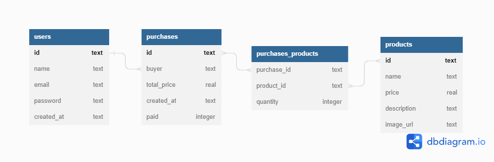

# Projeto labecommerce-backend


Esse é um projeto de introdução ao backend

## Indice
- <a href="#funcionalidades-do-projeto">Funcionalidades do projeto</a>
- <a href="#estrutura-do-banco-de-dados">Estrutura do Banco de dados</a>
- <a href="#demonstração">Demonstração</a>
- <a href="#como-rodar-o-projeto?">Como rodar o projeto?
- <a href="#tecnologias-utilizadas">Tecnologias utilizadas</a>
- <a href="#autor">Autor</a>

## Funcionalidades do projeto

- [x]Buscar todos os usuários cadastrados
- [x]Buscar todos os produtos cadastrados
- [x]Buscar todas as compras cadastradas
- [x]Buscar usuário pelo ID
- [x]Buscar produto pelo ID
- [x]Buscar compra pelo ID
- [x]Buscar todas as compras de um único usuário
- [x]Cadastrar um novo usuário
- [x]Cadastrar um novo produto
- [x]Cadastrar uma nova compra
- [x]Excluir usuário pelo ID
- [x]Deletar produto pelo ID
- [x]Cancelar compra pelo ID
- [x]Editar usuário pelo ID
- [x]Editar produto por ID

## Estrutura do Banco de dados



## Demonstração
[Link da documentação API](https://documenter.getpostman.com/view/24460946/2s8ZDcyezk)

## Como rodar o projeto?

```bash
#Clone este repositório
$ git clone linkdorepositorio

#Acesse a pasta do projeto no seu terminal
$ cd labecommerce-backend

#Instale as dependências
$ npm install

# Execute a aplicação
$ npm rum start

# A aplicação será iniciada na porta 3003, acesse pelo postman e poderá executar os endpoints
```

## Tecnologias utilizadas

1. [Nodejs](https://nodejs.org/en/docs/)
2. [Typescript](https://www.typescriptlang.org/)
3. [Express](https://expressjs.com/pt-br/)
4. [SQLite](https://www.sqlite.org/index.html)
5. [Knexjs](https://knexjs.org/)
6. [Postman](https://www.postman.com/)

## Autor


[Linkedin](linkedin.com/in/santos-s-gabriel)